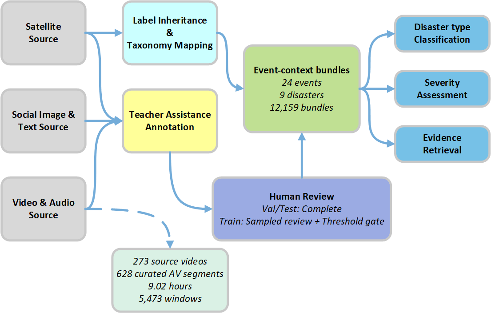
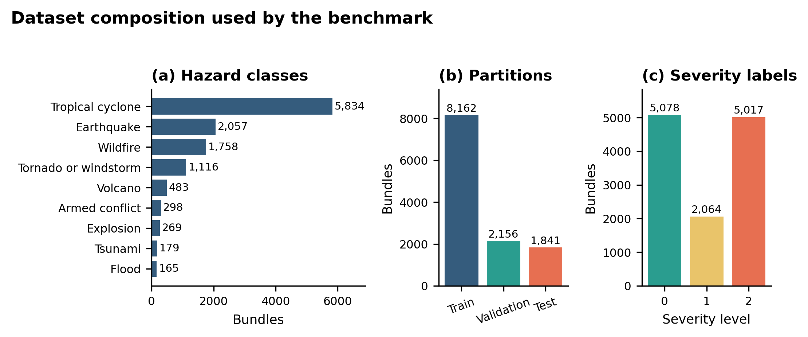

# DisasterScope

## A Multi-Source Multimodal Dataset and Benchmark for Disaster Response and Severity Assessment

DisasterScope is an event-centric multimodal dataset and benchmark that connects regional satellite observations with ground-level social images, synchronized audio and video, optional observation text, report passages, and provenance metadata. It is designed for disaster type recognition, three-level severity assessment, and satellite-grounded evidence retrieval.

DisasterScope contains **12,159 fixed event-context bundles** from **24 disaster events** and **9 disaster classes**. Its dynamic-media inventory contains **273 source videos**, **628 curated audio-video segments**, **9.02 hours** of material, and **5,473 temporal windows**.

## What makes DisasterScope different?

- **Event-centric organization:** heterogeneous evidence is linked through a canonical disaster-event identity.
- **Macro and micro views:** satellite pre/post observations capture regional change, while social and dynamic media provide ground-level evidence.
- **Explicit modality roles:** satellite, social image, audio, video, and observation text remain separate inputs rather than being silently merged.
- **Fixed bundle identities:** full-input and unavailable-input evaluations use the same samples, making modality-removal comparisons easier to interpret.
- **Multiple tasks:** one benchmark supports disaster type classification, ordinal severity assessment, and same-event evidence retrieval.

An event-context bundle indicates that its views belong to the same canonical disaster context. It does **not** imply that the satellite and ground-level observations show the same street, structure, or exact moment. Audio and video within a curated segment are synchronized.

## Modalities and evidence roles

| Symbol    | Modality             | Role in DisasterScope                                                            |
| --------- | -------------------- | -------------------------------------------------------------------------------- |
| **S**     | Satellite imagery    | Regional pre-event/post-event observations from satellite source datasets        |
| **I**     | Social image         | Ground-level visual evidence associated with a disaster event                    |
| **A**     | Audio                | Audio stream from a curated, synchronized dynamic-media segment                  |
| **V**     | Video                | Video stream from the same curated dynamic-media segment                         |
| **T_obs** | Observation text     | Optional text associated with the social observation                             |
| —         | Reports and passages | Supporting evidence and retrieval corpora; not silently used as classifier input |

The two primary input settings are **SIAV** and **SIAVT**, where SIAVT adds observation text to the four core visual/audio views.

## Dataset at a glance

The following inventory reproduces the main dataset statistics reported in the paper. Counts use their native units because a bundle, asset group, observation, video, segment, and temporal window are different objects.

| Item                                | Count                 | Native unit                    |
| ----------------------------------- | ---------------------:| ------------------------------ |
| Events                              | 24                    | event                          |
| Disaster classes                    | 9                     | class                          |
| Fixed benchmark bundles             | 12,159                | bundle                         |
| Training / validation / test        | 8,162 / 2,156 / 1,841 | bundle                         |
| Satellite groups used               | 1,254                 | asset group                    |
| Social observations used            | 12,083                | observation                    |
| AV segments used by fixed bundles   | 550                   | segment                        |
| Source videos used by fixed bundles | 268                   | video                          |
| Full dynamic-media inventory        | 273 / 628             | source video / curated segment |
| Curated dynamic-media duration      | 9.02                  | hour                           |
| Derived temporal windows            | 5,473                 | window                         |

### Covered disaster classes

DisasterScope covers tropical cyclones, earthquakes, wildfires, tornadoes or windstorms, volcanoes, armed conflict, explosions, tsunamis, and floods. Coverage is not uniform across disaster classes or regions; results should therefore be interpreted within the represented source distribution.

## Benchmark tasks

| Task                         | Evaluation unit               | Target                                              | Primary metrics     | Evaluation setting                                             |
| ---------------------------- | ----------------------------- | --------------------------------------------------- | ------------------- | -------------------------------------------------------------- |
| Disaster type classification | Event-context bundle          | 9 disaster classes                                  | Macro-F1            | SIAV and SIAVT; full and unavailable-input conditions          |
| Severity assessment          | Eligible event-context bundle | 3 ordered severity levels                           | Macro-F1, MAE, QWK  | SIAV and SIAVT; full and unavailable-input conditions          |
| Evidence retrieval           | Satellite-grounded query      | Binary same-event relevance over 3 candidate routes | nDCG@10, mAP, Hit@K | Social-image, audio-video, and combined ground-evidence routes |

For retrieval, satellite evidence is the query. The candidate routes represent a social observation, a synchronized audio-video segment, or a combined ground-evidence bundle. Relevance is defined at the canonical-event level rather than as exact local correspondence.

## Contact

For questions about DisasterScope, research use, or future access information, contact **Jieli Chen** at [jieli.chen@liverpool.ac.uk](mailto:jieli.chen@liverpool.ac.uk).
